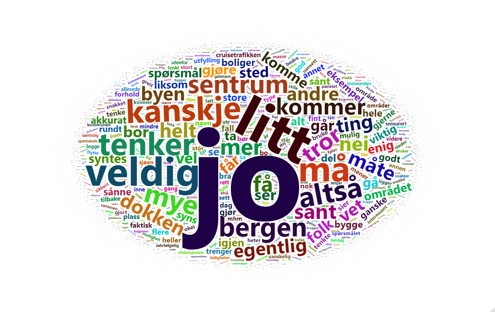

# Dokken {#dokken}

```{r ordsky-dokken, fig.align = 'center', out.width = "100%", fig.cap = "Ordsky fra gruppediskusjonene om Dokken"}

```

Deltakerne diskuterte spørsmål om Bilfrie områder på ettermiddagen.
Ordskyen gir et visuelt inntrykk av hva deltakerne snakket om.
Vi anbefaler interesserte å lese gjennom det rike [transkriberte materialet](https://hdl.handle.net/11250/2827447), som gjengir samtalene i alle gruppene (i anonymisert form).
For videre kontekstualisering er det også nyttig å lese [informasjonsmaterialet](https://hdl.handle.net/11250/2827447), som viser hvilket felles referansegrunnlag deltakerne diskuterte ut fra.

## Svarfordeling for alle spørsmål om Dokken. 

Under følger spørsmålsformuleringene deltakerne fikk og svarene de ga om Dokken, etter at de hadde diskutert sakene i grupper og deltatt på plenumssesjon om temaet.

Vi har gitt søylene ulike gråtoner for å lettere kunne identifisere hva flertallet mener i hver enkelt sak.
De som har svart den nøytrale midtkategorien "5" eller svart "Vet ikke", har blitt utelatt fra beregningen av flertallet.
Det er imidlertid viktig å vurdere fra sak til sak hvor mange som har gitt slike svar, da det sier noe om hvor sterke preferanser deltakerne samlet har om saken.

Vi presenterer holdningene til deltakerne samlet.
Antall deltakere er ikke stort nok til å gjøre analyser av undergrupper, slik som for eksempel hva innbyggere fra de ulike bydelene mener om spørsmålene.


### Cruisetrafikk ut av sentrum?

>Nå er det besluttet at havneaktivitet knyttet til gods skal flyttes fra Dokken til nytt anlegg på Ågotnes.
Selv om godshavnen flyttes er det fremdeles flere andre havneaktiviteter som kan bli værende på Dokken eller et annet sted i Bergen sentrum. Alternativet er å flytte oppgavene ut av sentrum til andre områder, og heller bruke Dokken til andre formål.
Noen mener at cruisetrafikken bør bli værende i sentrum for å legge til rette for turistnæringen. Andre mener den bør legges utenfor sentrum fordi skipene forurenser og tar opp verdifull plass sentralt i byen. Hva mener du?


```{r Q3}


post_t_delib <- post_t_delib %>% mutate(fill = case_when(Q3 %in% 1:5 ~ "Mindretall",
                                          Q3 == 6 | Q3 == 12 ~ "Ikke medregnet",
                                          Q3 %in% 7:11 ~ "Flertall"))
plot <- ggplot(post_t_delib, aes(x = factor(Q3), fill = fill)) +
  geom_bar(aes(y = (..count..) / sum(..count..))) +
  scale_y_continuous(labels = scales::percent_format(accuracy = 1L)) +
  scale_x_discrete(limits = c('1', '2', '3', '4', '5', '6', '7', '8', '9', '10', '11', '12'),
                   labels = c('0', '1', '2', '3', '4', '5', '6', '7', '8', '9', '10', 'Vet ikke')) +
   labs(title = "Cruisetrafikken ut av sentrum?", x = 'Svarfordeling fra 0 = Må bli værende til 10 = Må flyttes ut', y = 'Prosent', fill = '')  +
  theme_classic() +
  scale_fill_grey(start = 0, end = 0.9)
  
plot
```

Av de som uttrykte en mening enten for eller mot å flytte cruisetrafikken ut av sentrum mente `r round(sum((post_t_delib$fill=='Mindretall') / (sum(post_t_delib$fill=='Mindretall')+(sum(post_t_delib$fill=='Flertall'))))*100, 0)` prosent at cruisetrafikken må bli værende i sentrum, mens `r round(sum((post_t_delib$fill=='Flertall') / (sum(post_t_delib$fill=='Mindretall')+(sum(post_t_delib$fill=='Flertall'))))*100, 0)` prosent mener at den må flyttes ut av sentrum.

Det er også verdt å merke seg at mange av de som mener den må flyttes ut av sentrum mener dette ekstremt sterkt.

### Utenlandsferger ut av sentrum?

>Noen mener også at utenlands fergetilbud (som Danskebåten) bør bli værende i sentrum for å legge til rette for turistnæringen. Andre mener den bør legges utenfor sentrum fordi skipene forurenser og tar opp verdifull plass sentralt i byen. Hva mener du?

```{r Q4}
post_t_delib <- post_t_delib %>% 
  filter(!is.na(Q4)) %>% 
  mutate(fill = case_when(Q4 %in% 1:5 ~ "Mindretall",
                                          Q4 == 6 | Q4 == 12 ~ "Ikke medregnet",
                                          Q4 %in% 7:11 ~ "Flertall"))
plot <- ggplot(post_t_delib, aes(x = factor(Q4), fill = fill)) +
  geom_bar(aes(y = (..count..) / sum(..count..))) +
  scale_y_continuous(labels = scales::percent_format(accuracy = 1L)) +
  scale_x_discrete(limits = c('1', '2', '3', '4', '5', '6', '7', '8', '9', '10', '11', '12'),
                   labels = c('0', '1', '2', '3', '4', '5', '6', '7', '8', '9', '10', 'Vet ikke')) +
   labs(title = "Utenlandsferger ut av sentrum?", x = 'Svarfordeling fra 0 = Må bli værende til 10 = Må flyttes ut', y = 'Prosent', fill = '')  +
  theme_classic() +
  scale_fill_grey(start = 0, end = 0.9)
  
plot

```
Av de som uttrykte en mening enten for eller mot å flytte utenlandsfergene ut av sentrum mente `r round(sum((post_t_delib$fill=='Mindretall') / (sum(post_t_delib$fill=='Mindretall')+(sum(post_t_delib$fill=='Flertall'))))*100, 0)` prosent at utenlandsfergene må bli værende i sentrum, mens `r round(sum((post_t_delib$fill=='Flertall') / (sum(post_t_delib$fill=='Mindretall')+(sum(post_t_delib$fill=='Flertall'))))*100, 0)` prosent mener at de må flyttes ut av sentrum.

### Utfylling i sjø

>Utfylling i sjø er en mulighet som vurderes på Dokken. Noen er for dette fordi det gir mer plass til boliger, næring og parker sentralt i byen. 
Andre er mot dette fordi de ønsker å bevare sjøfronten slik den ser ut i dag og for å spare dyrelivet i sjøen. Hva mener du, bør kommunen fylle ut i sjøen når de fornyer havneområdet på Dokken?

```{r Q5}
post_t_delib <- post_t_delib %>% 
filter(!is.na(Q5)) %>%
mutate(fill = case_when(Q5 %in% 1:5 ~ "Mindretall",
                                          Q5 == 6 | Q5 == 12 ~ "Ikke medregnet",
                                          Q5 %in% 7:11 ~ "Flertall"))
plot <- ggplot(post_t_delib, aes(x = factor(Q5), fill = fill)) +
  geom_bar(aes(y = (..count..) / sum(..count..))) +
  scale_y_continuous(labels = scales::percent_format(accuracy = 1L)) +
  scale_x_discrete(limits = c('1', '2', '3', '4', '5', '6', '7', '8', '9', '10', '11', '12'),
                   labels = c('0', '1', '2', '3', '4', '5', '6', '7', '8', '9', '10', 'Vet ikke')) +
   labs(title = "Utfylling i sjø?", x = 'Svarfordeling fra 0 = Motsetter seg til 10 = Støtter', y = 'Prosent', fill = '')  +
  theme_classic() +
  scale_fill_grey(start = 0, end = 0.9)
  
plot

```
Av de som uttrykte en mening enten for eller mot utfylling i sjø på Dokken er det `r round(sum((post_t_delib$fill=='Mindretall') / (sum(post_t_delib$fill=='Mindretall')+(sum(post_t_delib$fill=='Flertall'))))*100, 0)` prosent som motsetter seg forslaget, mens `r round(sum((post_t_delib$fill=='Flertall') / (sum(post_t_delib$fill=='Mindretall')+(sum(post_t_delib$fill=='Flertall'))))*100, 0)` prosent støtter det.
Om lag en av fem hverken støtter eller motsetter seg forslaget.

### Hva sjølinjen skal brukes til

>Dokken har en 2500 meter lang sjølinje som i dag brukes til havneaktivitet. 
Noen mener at havneaktiviteten må prioriteres langs sjølinjen på Dokken for å kunne legge til rette for større skip og bedrifter med behov for kai.
Andre mener sjølinjen må gjøres tilgjengelig for byens innbyggere og besøkende for rekreasjon med for eksempel badeplasser og parker, eller tilrettelegging for natur- og dyreliv. 
Hva mener du?

```{r Q6}
post_t_delib <- post_t_delib %>% 
  filter(!is.na(Q6)) %>%
  mutate(fill = case_when(Q6 %in% 1:5 ~ "Mindretall",
                                          Q6 == 6 | Q6 == 12 ~ "Ikke medregnet",
                                          Q6 %in% 7:11 ~ "Flertall")) 

plot <- ggplot(post_t_delib, aes(x = factor(Q6), fill = fill)) +
  geom_bar(aes(y = (..count..) / sum(..count..))) +
  scale_y_continuous(labels = scales::percent_format(accuracy = 1L)) +
  scale_x_discrete(limits = c('1', '2', '3', '4', '5', '6', '7', '8', '9', '10', '11', '12'),
                   labels = c('0', '1', '2', '3', '4', '5', '6', '7', '8', '9', '10', 'Vet ikke')) +
   labs(title = "Sjølinjen", x = 'Svarfordeling fra 0 = Fortsatt havneaktivitet, til 10 = Rekreasjon eller natur- og dyreliv', y = 'Prosent', fill = '')  +
  theme_classic() +
  scale_fill_grey(start = 0, end = 0.9)
  
plot

```

Av de som uttrykte en prioritering angående hva sjølinjen skal brukes til er det `r round(sum((post_t_delib$fill=='Mindretall') / (sum(post_t_delib$fill=='Mindretall')+(sum(post_t_delib$fill=='Flertall'))))*100, 0)` prosent som ønsker fortsatt havneaktivitet, mens `r round(sum((post_t_delib$fill=='Flertall') / (sum(post_t_delib$fill=='Mindretall')+(sum(post_t_delib$fill=='Flertall'))))*100, 0)` prosent ønsker at området skal prioriteres til rekreasjon eller natur- og dyreliv.


### Boligpolitikk

>Noen mener at prisene på boliger som bygges på Dokken må styres ved at myndighetene tar en aktiv rolle i utviklingen av rimelige boliger folk flest har råd til å bo i. 
Andre mener at boliger på Dokken bør selges til ordinær markedspris. 
Hva mener du?

```{r Q7}
post_t_delib <- post_t_delib %>% 
  filter(!is.na(Q7)) %>%
  mutate(fill = case_when(Q7 %in% 1:5 ~ "Flertall",
                                          Q7 == 6 | Q7 == 12 ~ "Ikke medregnet",
                                          Q7 %in% 7:11 ~ "Mindretall")) 

plot <- ggplot(post_t_delib, aes(x = factor(Q7), fill = fill)) +
  geom_bar(aes(y = (..count..) / sum(..count..))) +
  scale_y_continuous(labels = scales::percent_format(accuracy = 1L)) +
  scale_x_discrete(limits = c('1', '2', '3', '4', '5', '6', '7', '8', '9', '10', '11', '12'),
                   labels = c('0', '1', '2', '3', '4', '5', '6', '7', '8', '9', '10', 'Vet ikke')) +
   labs(title = "Boligpolitikk", x = 'Svarfordeling fra 0 = Sikre rimelige boliger, til 10 = Ikke blande seg inn', y = 'Prosent', fill = '')  +
  theme_classic() +
  scale_fill_grey(start = 0, end = 0.9)
  
plot

```

Det er svært sterk støtte for at kommunen skal sikre rimelige boliger på Dokken.
Av de som uttrykte en mening om hvorvidt kommunen skal sikre rimelige boliger eller om de ikke skal blande seg inn i hva boligene på Dokken skal koste, er det `r round(sum((post_t_delib$fill=='Flertall') / (sum(post_t_delib$fill=='Mindretall')+(sum(post_t_delib$fill=='Flertall'))))*100, 0)` prosent som ønsker at rimelige boliger sikres, mens `r round(sum((post_t_delib$fill=='Mindretall') / (sum(post_t_delib$fill=='Mindretall')+(sum(post_t_delib$fill=='Flertall'))))*100, 0)` prosent ønsker at kommunen ikke skal blande seg inn.

### Parker vs. idrettsanlegg

>Noen mener at parker og grøntarealer bør prioriteres på Dokken framfor idrettsanlegg som for eksempel fotballbane og flerbrukshall. 
Dette fordi flere har nytte av grøntarealer enn av idrettsanlegg. 
Andre mener idrettsanlegg må prioriteres fordi det er mangel på slike tilbud sentralt i Bergen.
Hva mener du?

```{r Q8}
post_t_delib <- post_t_delib %>%  
filter(!is.na(Q8)) %>%
 mutate(fill = case_when(Q8 %in% 1:5 ~ "Flertall",
                                          Q8 == 6 | Q8 == 12 ~ "Ikke medregnet",
                                          Q8 %in% 7:11 ~ "Mindretall")) 

plot <- ggplot(post_t_delib, aes(x = factor(Q8), fill = fill)) +
  geom_bar(aes(y = (..count..) / sum(..count..))) +
  scale_y_continuous(labels = scales::percent_format(accuracy = 1L)) +
  scale_x_discrete(limits = c('1', '2', '3', '4', '5', '6', '7', '8', '9', '10', '11', '12'),
                   labels = c('0', '1', '2', '3', '4', '5', '6', '7', '8', '9', '10', 'Vet ikke')) +
   labs(title = "Parker vs. idrettsanlegg", x = 'Svarfordeling fra 0 = Prioritere parker, til 10 = Prioritere idrettsanlegg', y = 'Prosent', fill = '')  +
  theme_classic() +
  scale_fill_grey(start = 0, end = 0.9)
  
plot

```

Av de som uttrykte en prioritering mellom parker/grøntarealer og idrettsanlegg, er det hele `r round(sum((post_t_delib$fill=='Flertall') / (sum(post_t_delib$fill=='Mindretall')+(sum(post_t_delib$fill=='Flertall'))))*100, 0)` prosent som ønsker at parker får forrang framfor idrettsanlegg, mens `r round(sum((post_t_delib$fill=='Mindretall') / (sum(post_t_delib$fill=='Mindretall')+(sum(post_t_delib$fill=='Flertall'))))*100, 0)` prosent vil prioritere idrettsanlegg.


### Nye gatenavn

>Noen mener at alle nye gater på Dokken som skal kalles opp etter historiske personer må ha navn etter kvinner, for å bidra til å rette opp den skjeve fordelingen av eksisterende gatenavn i byen. 
Andre er imot dette, fordi personer som har gjort seg fortjent til å få en gate kalt opp etter seg ikke skal hindres på grunn av sitt kjønn.
Hva mener du?


```{r Q9}
post_t_delib <- post_t_delib %>% 
  filter(!is.na(Q9)) %>%
  mutate(fill = case_when(Q9 %in% 1:5 ~ "Mindretall",
                                          Q9 == 6 | Q9 == 12 ~ "Ikke medregnet",
                                          Q9 %in% 7:11 ~ "Flertall")) 

plot <- ggplot(post_t_delib, aes(x = factor(Q9), fill = fill)) +
  geom_bar(aes(y = (..count..) / sum(..count..))) +
  scale_y_continuous(labels = scales::percent_format(accuracy = 1L)) +
  scale_x_discrete(limits = c('1', '2', '3', '4', '5', '6', '7', '8', '9', '10', '11', '12'),
                   labels = c('0', '1', '2', '3', '4', '5', '6', '7', '8', '9', '10', 'Vet ikke')) +
   labs(title = "Kalle opp nye gatenavn etter kvinner", x = 'Svarfordeling fra 0 = Motsetter seg, til 10 = Støtter', y = 'Prosent', fill = '')  +
  theme_classic() +
  scale_fill_grey(start = 0, end = 0.9)
  
plot

```


Av de som uttrykte en mening om hvorvidt nye gatenavn på Dokken som skal kalles opp etter historiske personer utelukkende skal ha navn etter kvinner eller ikke, mener `r round(sum((post_t_delib$fill=='Mindretall') / (sum(post_t_delib$fill=='Mindretall')+(sum(post_t_delib$fill=='Flertall'))))*100, 0)` prosent at de ikke skal det, og `r round(sum((post_t_delib$fill=='Flertall') / (sum(post_t_delib$fill=='Mindretall')+(sum(post_t_delib$fill=='Flertall'))))*100, 0)` prosent mener at de skal det.
Verdt å merke seg er at mange er i tvende sinn om spørsmålet (både svaralternativ 5 og "Vet ikke"-kategoriene har høyere svarandel enn i mange andre spørsmål).
Samtidig har mange av de som har gjort seg opp en mening sterke meninger om saken, i begge endene av holdningsspekteret.


## Endring i holdninger
```{r results-dokken-change}
#Gjør om "Vet ikke" til missing
demovate_all <- demovate_all %>% mutate(Q3 = na_if(Q3, 12),
Q4 = na_if(Q4, 12),
Q5 = na_if(Q5, 12),
Q6 = na_if(Q6, 12),
Q7 = na_if(Q7,12),
Q8 = na_if(Q8,12),
Q9 = na_if(Q9,12)
)
demovate_all_srv <- srvyr::as_survey_design(demovate_all, ids = id)

Q3 <- demovate_all_srv %>%
group_by(time, treated) %>%
summarise(mean = survey_mean(Q3, na.rm = T, vartype = c("ci", "se"))) %>%
mutate(question = "Q3") %>%
ungroup()

Q4 <- demovate_all_srv %>%
group_by(time, treated) %>%
summarise(mean = survey_mean(Q4, na.rm = T, vartype = c("ci", "se"))) %>%
mutate(question = "Q4") %>%
ungroup()

Q5 <- demovate_all_srv %>%
group_by(time, treated) %>%
summarise(mean = survey_mean(Q5, na.rm = T, vartype = c("ci", "se"))) %>%
mutate(question = "Q5") %>%
ungroup()

Q6 <- demovate_all_srv %>%
group_by(time, treated) %>%
summarise(mean = survey_mean(Q6, na.rm = T, vartype = c("ci", "se"))) %>%
mutate(question = "Q6") %>%
ungroup()

Q7 <- demovate_all_srv %>%
group_by(time, treated) %>%
summarise(mean = survey_mean(Q7, na.rm = T, vartype = c("ci", "se"))) %>%
mutate(question = "Q7") %>%
ungroup()

Q8 <- demovate_all_srv %>%
group_by(time, treated) %>%
summarise(mean = survey_mean(Q8, na.rm = T, vartype = c("ci", "se"))) %>%
mutate(question = "Q8") %>%
ungroup()

Q9 <- demovate_all_srv %>%
group_by(time, treated) %>%
summarise(mean = survey_mean(Q9, na.rm = T, vartype = c("ci", "se"))) %>%
mutate(question = "Q9") %>%
ungroup()

dokken <- bind_rows(list(Q3, Q4, Q5, Q6, Q7, Q8, Q9)) %>%
mutate(Undersøkelse = case_when(time == 0 ~ "Før",
time == 1 ~ "Etter"),
Gruppe = case_when(treated == 0 ~ "Kontrollgruppe",
treated == 1 ~ "Deltakergruppe"),
Sak = case_when(question == 'Q3' ~ 'Cruisetrafikk ut av sentrum',
question == 'Q4' ~ 'Utenlandsferger ut av sentrum',
question == 'Q5' ~ 'Utfylling i sjø',
question == 'Q6' ~ 'Hva sjølinjen skal brukes til',
question == 'Q7' ~ 'Boligpolitikk',
question == 'Q8' ~ 'Parker vs. idrettsanlegg',
question == 'Q9' ~ 'Nye gatenavn'))

# Gjør om Undersøkelse til faktor og endre rekkefølgen
dokken <- dokken %>%
mutate(Undersøkelse = factor(Undersøkelse,
levels = c("Før",
"Etter")))
```
Det er observert gjentatte ganger i tidligere studier at deltakerne endrer holdninger til spørsmålene etter at de har satt seg inn i dem og diskutert dem med andre (se Fishkin m.fl [-@fishkin2021deliberation] for et nylig eksempel).
Vi analyserer om det er tilfelle også i vårt tilfelle for den deliberative meningsmålingen i Bergen.
Tabellen viser gjennomsnittlig score for spørsmålene om Dokken, før og etter arrangementet den 12. juni.

```{r dokken-results-table1}
dokken %>% arrange(Sak, Gruppe, Undersøkelse) %>%
select(Sak, Gruppe, Undersøkelse, Gj.snitt = mean) %>%
kableExtra::kable(., booktabs = T, digits = 1, caption = 'Gjennomsnitt for deltakergruppen') %>% kable_styling(c('striped', 'hover'))%>%
collapse_rows(columns = c(1, 2))
```

> Hvordan lese figuren:
Figuren "Holdningsendringer før og etter arrangementet" viser hvordan gruppene har endret holdninger mellom første og andre undersøkelse.
De svarte prikkene indikerer gjennomsnittlig holdningsendring for deltakergruppen før og etter deliberasjon.
De motsvarende grå prikkene viser kontrollgruppens endring fra før og etter arrangementet (som de ikke deltok på).
Den stiplete linjen er utgangspunktet, som var gjennomsnittene for spørsmålene i førundersøkelsen.
Dersom prikkene ligger til venstre, har gjennomsnittet blitt lavere.
Dersom prikkene ligger til høyre, har gjennomsnittet blitt høyere.
Hvis linjene som er trukket gjennom prikkene *ikke overlapper den stiplete linjen* kan vi med høy grad av sikkerhet konkludere at endringen før og etter arrangementet er reell, og ikke et utslag av tilfeldigheter.

Figuren viser at deltakerne for de fleste spørsmålene har et høyere gjennomsnitt etter å ha deltatt i deliberasjonen.
Dette gjelder også for kontrollgruppen, men ikke i like sterk grad.
Forskjellene mellom deltakergruppene er ikke markante, men vi ser en tendens til at deltakerne i sterkere endrer oppfatning i etterundersøkelsen.

```{r dokken-results-manage-2}
# forskjeller i gjennomsnitt for de ulike gruppene

library(broom)

# Q3
change_Q3_c <- demovate_all %>% select(time, treated, Q3) %>% 
  filter(treated == 0) 

Q3_lm_c <- lm(Q3 ~ time, data = change_Q3_c) 
Q3_lm_c <- tidy(Q3_lm_c, conf.int = TRUE) %>% 
  mutate(Question = "Q3", 
         Gruppe = "Kontrollgruppe")

change_Q3_t <- demovate_all %>% select(time, treated, Q3) %>% 
  filter(treated == 1)

Q3_lm_t <- lm(Q3 ~ time, data = change_Q3_t) 
Q3_lm_t <- tidy(Q3_lm_t, conf.int = TRUE) %>% 
mutate(Question = "Q3", 
         Gruppe = "Deltakergruppe")

# Q4

change_Q4_c <- demovate_all %>% select(time, treated, Q4) %>% 
  filter(treated == 0) 

Q4_lm_c <- lm(Q4 ~ time, data = change_Q4_c) 
Q4_lm_c <- tidy(Q4_lm_c, conf.int = TRUE) %>% 
  mutate(Question = "Q4", 
         Gruppe = "Kontrollgruppe")

change_Q4_t <- demovate_all %>% select(time, treated, Q4) %>% 
  filter(treated == 1)

Q4_lm_t <- lm(Q4 ~ time, data = change_Q4_t) 
Q4_lm_t <- tidy(Q4_lm_t, conf.int = TRUE) %>% 
  mutate(Question = "Q4", 
         Gruppe = "Deltakergruppe")

# Q5

change_Q5_c <- demovate_all %>% select(time, treated, Q5) %>% 
  filter(treated == 0) 

Q5_lm_c <- lm(Q5 ~ time, data = change_Q5_c) 
Q5_lm_c <- tidy(Q5_lm_c, conf.int = TRUE) %>% 
  mutate(Question = "Q5", 
         Gruppe = "Kontrollgruppe")

change_Q5_t <- demovate_all %>% select(time, treated, Q5) %>% 
  filter(treated == 1)

Q5_lm_t <- lm(Q5 ~ time, data = change_Q5_t) 
Q5_lm_t <- tidy(Q5_lm_t, conf.int = TRUE) %>% 
  mutate(Question = "Q5", 
         Gruppe = "Deltakergruppe")

# Q6

change_Q6_c <- demovate_all %>% select(time, treated, Q6) %>% 
  filter(treated == 0) 

Q6_lm_c <- lm(Q6 ~ time, data = change_Q6_c) 
Q6_lm_c <- tidy(Q6_lm_c, conf.int = TRUE) %>% 
  mutate(Question = "Q6", 
         Gruppe = "Kontrollgruppe")

change_Q6_t <- demovate_all %>% select(time, treated, Q6) %>% 
  filter(treated == 1)

Q6_lm_t <- lm(Q6 ~ time, data = change_Q6_t) 
Q6_lm_t <- tidy(Q6_lm_t, conf.int = TRUE) %>% 
  mutate(Question = "Q6", 
         Gruppe = "Deltakergruppe")

# Q7

change_Q7_c <- demovate_all %>% select(time, treated, Q7) %>% 
  filter(treated == 0) 

Q7_lm_c <- lm(Q7 ~ time, data = change_Q7_c) 
Q7_lm_c <- tidy(Q7_lm_c, conf.int = TRUE) %>% 
  mutate(Question = "Q7", 
         Gruppe = "Kontrollgruppe")

change_Q7_t <- demovate_all %>% select(time, treated, Q7) %>% 
  filter(treated == 1)

Q7_lm_t <- lm(Q7 ~ time, data = change_Q7_t) 
Q7_lm_t <- tidy(Q7_lm_t, conf.int = TRUE) %>% 
  mutate(Question = "Q7", 
         Gruppe = "Deltakergruppe")

# Q8

change_Q8_c <- demovate_all %>% select(time, treated, Q8) %>% 
  filter(treated == 0) 

Q8_lm_c <- lm(Q8 ~ time, data = change_Q8_c) 
Q8_lm_c <- tidy(Q8_lm_c, conf.int = TRUE) %>% 
  mutate(Question = "Q8", 
         Gruppe = "Kontrollgruppe")

change_Q8_t <- demovate_all %>% select(time, treated, Q8) %>% 
  filter(treated == 1)

Q8_lm_t <- lm(Q8 ~ time, data = change_Q8_t) 
Q8_lm_t <- tidy(Q8_lm_t, conf.int = TRUE) %>% 
  mutate(Question = "Q8", 
         Gruppe = "Deltakergruppe")

# Q9

change_Q9_c <- demovate_all %>% select(time, treated, Q9) %>% 
  filter(treated == 0) 

Q9_lm_c <- lm(Q9 ~ time, data = change_Q9_c) 
Q9_lm_c <- tidy(Q9_lm_c, conf.int = TRUE) %>% 
  mutate(Question = "Q9", 
         Gruppe = "Kontrollgruppe")

change_Q9_t <- demovate_all %>% select(time, treated, Q9) %>% 
  filter(treated == 1)

Q9_lm_t <- lm(Q9 ~ time, data = change_Q9_t) 
Q9_lm_t <- tidy(Q9_lm_t, conf.int = TRUE) %>% 
  mutate(Question = "Q9", 
         Gruppe = "Deltakergruppe")
  

endring_kontroll_treatment <- rbind(Q3_lm_c, Q3_lm_t,
                                    Q4_lm_c, Q4_lm_t,
                                    Q5_lm_c, Q5_lm_t,
                                    Q6_lm_c, Q6_lm_t,
                                    Q7_lm_c, Q7_lm_t,
                                    Q8_lm_c, Q8_lm_t,
                                    Q9_lm_c, Q9_lm_t)

endring_kontroll_treatment <- endring_kontroll_treatment %>% 
  mutate(Sak = case_when(Question == 'Q3' ~ 'Cruisetrafikk ut av sentrum',
                                                  Question == 'Q4' ~ 'Utenlandsferger ut av sentrum',
                                                  Question == 'Q5' ~ 'Utfylling i sjø',
                                                  Question == 'Q6' ~ 'Hva sjølinjen skal brukes til',
                                                  Question == 'Q7' ~ 'Boligpolitikk',
                                                  Question == 'Q8' ~ 'Parker vs. idrettsanlegg',
                                                  Question == 'Q9' ~ 'Nye gatenavn')) %>% 
  filter(term != "(Intercept)")
```

```{r dokken-results-figure2}
plot_endring_dokken <- ggplot(endring_kontroll_treatment,
mapping = aes(
x = Sak,
y = estimate,
ymin = conf.low,
ymax = conf.high,
colour = Gruppe
)) +
geom_hline(aes(yintercept=0), linetype = 'dotted') +
geom_pointrange(position = position_dodge(width = 1/2), size = 0.5, width = 0.1) +
  scale_color_grey()+
coord_flip() +
labs(title = 'Holdningsendringer før og \netter arrangement', subtitle = 'Dokken', y = 'Endring i gjennomsnitt', x = ' ', colour = ' ' ) +
theme_minimal() +
theme(
axis.text = element_text(colour = "black",
size = 12),
title = element_text(size = 14),
axis.title.x = element_text(size = 12, color = 'black'),
axis.line.x = element_line()


)

plot_endring_dokken
```


Det er verdt å bemerke at deltakernes endringer i positiv og negativ retning kan utlikne hverandre.
Vi har derfor også analysert absolutte endringer, og finner at deltakergruppen i hovedsak gjennomgår noe større holdningsendringer enn kontrollgruppen. 
Særlig i spørsmålet om cruisetrafikken skal flyttes ut sentrum ser vi en markant større absolutt holdningsendring blant deltakergruppen.

```{r dokken-absolute-change}

# hvor stor absolutt endring i treatment og kontroll?  

demovate_wide <- demovate_all %>%  pivot_wider(id_cols = c(id, treated), names_from = time, values_from = c(Q3:Q21))

demovate_wide_srv <- srvyr::as_survey_design(demovate_wide, ids = id)

Q3 <- demovate_wide_srv %>% group_by(treated) %>%
  summarise(diff = survey_mean(
    sqrt((Q3_1 - Q3_0)^2), vartype = c("ci"), na.rm = T)) %>% 
  mutate(question = "Q3")

Q4<- demovate_wide_srv %>% group_by(treated) %>%
  summarise(diff = survey_mean(
    sqrt((Q4_1 - Q4_0)^2), vartype = c("ci"), na.rm = T)) %>% 
  mutate(question = "Q4")

Q5<- demovate_wide_srv %>% group_by(treated) %>%
  summarise(diff = survey_mean(
    sqrt((Q5_1 - Q5_0)^2), vartype = c("ci"), na.rm = T)) %>% 
  mutate(question = "Q5")

Q6 <- demovate_wide_srv %>% group_by(treated) %>%
  summarise(diff = survey_mean(
    sqrt((Q6_1 - Q6_0)^2), vartype = c("ci"), na.rm = T)) %>% 
  mutate(question = "Q6")

Q7 <- demovate_wide_srv %>% group_by(treated) %>%
  summarise(diff = survey_mean(
    sqrt((Q7_1 - Q7_0)^2), vartype = c("ci"), na.rm = T)) %>% 
  mutate(question = "Q7")

Q8 <- demovate_wide_srv %>% group_by(treated) %>%
  summarise(diff = survey_mean(
    sqrt((Q8_1 - Q8_0)^2), vartype = c("ci"), na.rm = T)) %>% 
  mutate(question = "Q8")

Q9 <- demovate_wide_srv %>% group_by(treated) %>%
  summarise(diff = survey_mean(
    sqrt((Q9_1 - Q9_0)^2), vartype = c("ci"), na.rm = T)) %>% 
  mutate(question = "Q9")

dokken_absolutt_individuell_endring <- bind_rows(list(Q3, Q4, Q5, Q6, Q7, Q8, Q9)) %>% 
  mutate(Gruppe = case_when(treated == 0 ~ "Kontrollgruppe",
                            treated == 1 ~ "Deltakergruppe"),
         Sak = case_when(question == 'Q3' ~ 'Cruisetrafikk ut av sentrum',
                                                  question == 'Q4' ~ 'Utenlandsferger ut av sentrum',
                                                  question == 'Q5' ~ 'Utfylling i sjø',
                                                  question == 'Q6' ~ 'Hva sjølinjen skal brukes til',
                                                  question == 'Q7' ~ 'Boligpolitikk',
                                                  question == 'Q8' ~ 'Parker vs. idrettsanlegg',
                                                  question == 'Q9' ~ 'Nye gatenavn'))

```


```{r, plot-absolutt-dokken}

plot_absolutt_individuell_endring_dokken <- ggplot(dokken_absolutt_individuell_endring,
       mapping = aes(
         x = Sak,
         y = diff,
         ymin = diff_low,
         ymax = diff_upp,
         colour = Gruppe
       )) +
  geom_hline(aes(yintercept=0), linetype = 'dotted') +
  geom_pointrange(position = position_dodge(width = 1/2), size = 0.5, width = 0.1) + 
  scale_color_grey()+
  coord_flip() + 
  labs(title = 'Absolutt holdningsendring\nfør og etter arrangement', subtitle = 'Dokken', y = 'Gjennomsnittlig absolutt holdningsendring', x = ' ', colour = ' ' ) +
  theme_minimal() +
  theme(
    axis.text = element_text(colour = "black",
                             size = 12),
    title = element_text(size = 14),
    axis.title.x = element_text(size = 12, color = 'black'),
    axis.line.x = element_line()

  )

plot_absolutt_individuell_endring_dokken

```
