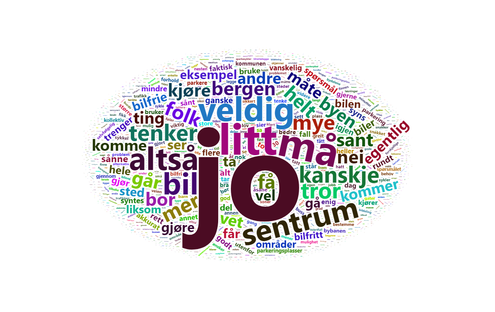

# Bilfrie områder {#bilfri}

```{r ordsky-bilfri, fig.align = 'center', out.width = "100%", fig.cap = "Ordsky fra gruppediskusjonene om bilfrie områder"}

```

## Svarfordeling for alle spørsmål om bilfrie områder 

Under følger svarene deltakerne ga om bilfrie områder, etter at de hadde diskutert sakene i grupper og deltatt på plenumssesjon om temaet.
Vi har gitt søylene ulike gråtoner for å lettere kunne identifisere hva flertallet mener i hver enkelt sak.
De som har svart den nøytrale midtkategorien "5" eller svart "Vet ikke", har blitt utelatt fra beregningen av flertallet.
Det er imidlertid viktig å vurdere fra sak til sak hvor mange som har gitt slike svar, da det sier noe om hvor sterke preferanser deltakerne samlet har om saken.


### Bergen sentrum mer bilfritt?

>Noen mener at Bergen sentrum allerede kan beskrives som et bilfritt område med restriksjoner på parkering og kjøring, et bredt mobilitetstilbud og gode forhold for byliv. 
Andre mener at Bergen sentrum bør bli helt bilfritt med unntak for personer med nedsatt funksjonsevne, utrykningskjøretøy, varelevering, renovasjon og lignende. 
Hva mener du? Bør kommunen gjøre ytterligere tiltak for å gjøre Bergen sentrum mer bilfri?

```{r Q11}
dp_t_post <- dp_t_post %>% mutate(fill = case_when(Q11 %in% 1:5 ~ "Flertall",
                                          Q11 == 6 | Q11 == 12 ~ "Ikke medregnet",
                                          Q11 %in% 7:11 ~ "Mindretall")) 

plot <- ggplot(dp_t_post, aes(x = factor(Q11), fill = fill)) +
  geom_bar(aes(y = (..count..) / sum(..count..))) +
  scale_y_continuous(labels = scales::percent_format(accuracy = 1L)) +
  scale_x_discrete(limits = c('1', '2', '3', '4', '5', '6', '7', '8', '9', '10', '11', '12'),
                   labels = c('0', '1', '2', '3', '4', '5', '6', '7', '8', '9', '10', 'Vet ikke')) +
   labs(title = "Bergen sentrum mer bilfritt enn i dag?", x = 'Svarfordeling fra 0 = Mer bilfritt, til 10 = Ikke mer bilfritt', y = 'Prosent', fill = '')  +
  theme_classic()+
  scale_fill_grey()
  
plot

```

 `r round(sum((dp_t_post$fill=='Flertall') / (sum(dp_t_post$fill=='Mindretall')+(sum(dp_t_post$fill=='Flertall'))))*100, 0)` prosent heller mot at Bergen sentrum må bli mer bilfritt enn det er i dag, mens `r round(sum((dp_t_post$fill=='Mindretall') / (sum(dp_t_post$fill=='Mindretall')+(sum(dp_t_post$fill=='Flertall'))))*100, 0)` prosent mener at det ikke skal det.
Dette er et polariserende spørsmål, hvor de mest hyppige svaret blant deltakerne er at man mener ekstremt sterkt at det må bli mer bilfritt, mens det nest mest hyppige svaret er at man mener ekstremt sterkt at det ikke skal bli mer bilfritt.

### Sentrumsnære strøk vs. ytre bydeler

>Noen mener at sentrumsnære strøk er godt egnet for utvikling av bilfrie områder.
Områdene har relativt god infrastruktur for sykkel, gange og kollektivtransport, nærhet til sentrum og er ikke bygget for bilkjøring i like stor grad som de ytre bydelene.
Andre mener at bilfrie områder bør utvikles i de ytre bydelene fordi problemet med bilavhengighet er større i disse områdene og innbyggerne har få insentiver til å redusere bilbruken sin. 
Hva mener du, bør kommunen prioritere utvikling av bilfrie områder i sentrumsnære strøk eller i ytre bydeler?

```{r Q12}
dp_t_post <- dp_t_post %>% mutate(fill = case_when(Q12 %in% 1:5 ~ "Flertall",
                                          Q12 == 6 | Q12 == 12 ~ "Ikke medregnet",
                                          Q12 %in% 7:11 ~ "Mindretall")) 

plot <- ggplot(dp_t_post, aes(x = factor(Q12), fill = fill)) +
  geom_bar(aes(y = (..count..) / sum(..count..))) +
  scale_y_continuous(labels = scales::percent_format(accuracy = 1L)) +
  scale_x_discrete(limits = c('1', '2', '3', '4', '5', '6', '7', '8', '9', '10', '11', '12'),
                   labels = c('0', '1', '2', '3', '4', '5', '6', '7', '8', '9', '10', 'Vet ikke')) +
   labs(title = "Sentrumsnære strøk vs. ytre bydeler", x = 'Svarfordeling fra 0 = Prioritere sentrum, til 10 = Prioritere ytre bydeler', y = 'Prosent', fill = '')  +
  theme_classic()+
  scale_fill_grey()
  
plot

```

Av de som uttrykte en prioritering mener et klart flertall på `r round(sum((dp_t_post$fill=='Flertall') / (sum(dp_t_post$fill=='Mindretall')+(sum(dp_t_post$fill=='Flertall'))))*100, 0)` prosent at sentrum skal prioriteres framfor de ytre bydelene, mens  `r round(sum((dp_t_post$fill=='Mindretall') / (sum(dp_t_post$fill=='Mindretall')+(sum(dp_t_post$fill=='Flertall'))))*100, 0)` prosent mener det motsatte.
Mange er også usikker på hvordan den geografiske prioriteringen bør gjøres.

### Store eller små områder?

>Noen mener at kommunen bør lage mange små, bilfrie områder, for eksempel i enkeltgater. 
Andre mener at kommunen bør lage noen få, store bilfrie områder, som for eksempel på i Bergen sentrum. 
Hva mener du, bør kommunen satse på å lage mange små eller noen få store bilfrie områder?

```{r Q13}
dp_t_post <- dp_t_post %>% mutate(fill = case_when(Q13 %in% 1:5 ~ "Flertall",
                                          Q13 == 6 | Q13 == 12 ~ "Ikke medregnet",
                                          Q13 %in% 7:11 ~ "Mindretall")) 

plot <- ggplot(dp_t_post, aes(x = factor(Q13), fill = fill)) +
  geom_bar(aes(y = (..count..) / sum(..count..))) +
  scale_y_continuous(labels = scales::percent_format(accuracy = 1L)) +
  scale_x_discrete(limits = c('1', '2', '3', '4', '5', '6', '7', '8', '9', '10', '11', '12'),
                   labels = c('0', '1', '2', '3', '4', '5', '6', '7', '8', '9', '10', 'Vet ikke')) +
   labs(title = "Mange små vs. store få bilfrie områder", x = 'Svarfordeling fra 0 = Mange små, til 10 = Store få', y = 'Prosent', fill = '')  +
  theme_classic()+
  scale_fill_grey()
  
plot

```

Flertallet på `r round(sum((dp_t_post$fill=='Flertall') / (sum(dp_t_post$fill=='Mindretall')+(sum(dp_t_post$fill=='Flertall'))))*100, 0)` prosent ønsker mange små bilfrie områder heller enn store, få områder. 
`r round(sum((dp_t_post$fill=='Mindretall') / (sum(dp_t_post$fill=='Mindretall')+(sum(dp_t_post$fill=='Flertall'))))*100, 0)` prosent mener det motsatte.
Forslaget er noe mindre polariserende enn flere av de andre spørsmålene om bilfrie soner, men blant de som støtter forslaget er det mange sterke tilhengere.

### Fleksibel bruk av parkeringsplasser

>Noen mener at en del parkeringsplasser skal kunne stenges for parkering i helgene for å kunne brukes til andre formål som uteservering, marked, lek, osv. 
Andre mener parkeringsplassene alltid må være åpne for parkering, fordi de som har bil trenger et sted å sette bilen også i helgene. 
Hva mener du?

```{r Q14}
dp_t_post <- dp_t_post %>% mutate(fill = case_when(Q14 %in% 1:5 ~ "Flertall",
                                          Q14 == 6 | Q14 == 12 ~ "Ikke medregnet",
                                          Q14 %in% 7:11 ~ "Mindretall")) 

plot <- ggplot(dp_t_post, aes(x = factor(Q14), fill = fill)) +
  geom_bar(aes(y = (..count..) / sum(..count..))) +
  scale_y_continuous(labels = scales::percent_format(accuracy = 1L)) +
  scale_x_discrete(limits = c('1', '2', '3', '4', '5', '6', '7', '8', '9', '10', '11', '12'),
                   labels = c('0', '1', '2', '3', '4', '5', '6', '7', '8', '9', '10', 'Vet ikke')) +
   labs(title = "Stenge parkeringsplasser i helgene", x = 'Svarfordeling fra 0 = Motsetter seg, til 10 = Støtter', y = 'Prosent', fill = '')  +
  theme_classic()+
  scale_fill_grey()
  
plot

```

`r round(sum((dp_t_post$fill=='Flertall') / (sum(dp_t_post$fill=='Mindretall')+(sum(dp_t_post$fill=='Flertall'))))*100, 0)` prosent motsetter seg at parkeringsplasser skal kunne stenges for annen bruk i helgene, mens
`r round(sum((dp_t_post$fill=='Mindretall') / (sum(dp_t_post$fill=='Mindretall')+(sum(dp_t_post$fill=='Flertall'))))*100, 0)` prosent mener de kan stenges.
Det klart mest hyppige svaret er at man motsetter seg ekstremt sterkt at parkeringsplasser skal kunne stenges i helgene.


### Fordeling av parkeringsplasser

>I dag reserveres en del parkeringsplasser i byen til bildeleordninger. 
Noen mener dette er bra, siden ordningene gjøre det lettere for folk ikke å eie egen bil. 
Det kan også frigi fellesarealer til andre aktiviteter i nabolaget. 
Andre mener dette ikke er bra fordi færre parkeringsplasser for privatbiler gjør at det innskrenker hver enkelt sin frihet. 
Hva mener du, hvordan skal andelen parkeringsplasser fordeles mellom privatbiler og bildeleordninger?

```{r Q15}
dp_t_post <- dp_t_post %>% mutate(fill = case_when(Q15 %in% 1:5 ~ "Mindretall",
                                          Q15 == 6 | Q15 == 12 ~ "Ikke medregnet",
                                          Q15 %in% 7:11 ~ "Flertall")) 

plot <- ggplot(dp_t_post, aes(x = factor(Q15), fill = fill)) +
  geom_bar(aes(y = (..count..) / sum(..count..))) +
  scale_y_continuous(labels = scales::percent_format(accuracy = 1L)) +
  scale_x_discrete(limits = c('1', '2', '3', '4', '5', '6', '7', '8', '9', '10', '11', '12'),
                   labels = c('0', '1', '2', '3', '4', '5', '6', '7', '8', '9', '10', 'Vet ikke')) +
   labs(title = "Andel parkeringsplasser til private biler vs. bildeling", x = 'Svarfordeling fra 0 = Flere plasser til privatbiler, til 10 = Flere plasser til bildeling', y = 'Prosent', fill = '')  +
  theme_classic()+
  scale_fill_grey()
  
plot
```


Svaralternativ 5 betyr at fordelingen mellom private parkeringsplasser og bildelingsplasser skal være som i dag.
Dette er det mest foretrukne alternativet, og støttes av nesten en tredjedel av deltakerne.
Av de som ønsker en endring fra dagens situasjon vil `r round(sum((dp_t_post$fill=='Flertall') / (sum(dp_t_post$fill=='Mindretall')+(sum(dp_t_post$fill=='Flertall'))))*100, 0)` prosent øke andelen parkeringsplasser til bildeling, mens
`r round(sum((dp_t_post$fill=='Mindretall') / (sum(dp_t_post$fill=='Mindretall')+(sum(dp_t_post$fill=='Flertall'))))*100, 0)` prosent ønsker å øke andelen til privatbiler.

### Begrense bilkjøring

>En bilfri sone er ikke helt bilfri, da det trengs tilkomst for varelevering/flyttelass, spesielle forflytningsbehov og for utrykningskjøretøy. 
Likevel finnes det tiltak som kan begrense biltrafikken, og vi ber deg indikere hvilken måte du foretrekker av de fire under:

```{r Q16}

plot <- ggplot(dp_t_post, aes(x = factor(Q16))) +
  geom_bar(aes(y = (..count..) / sum(..count..))) +
  scale_y_continuous(labels = scales::percent_format(accuracy = 1L)) +
  scale_x_discrete(labels = c('Skilt med gjennomkjøring forbudt', 'Fysiske hindringer \nsom tvinger ned farten', 'Fysiske sperrer \nsom kan fjernes for nødvendig trafikk', 'Lavest mulig fartsgrense (30 km/t)'), drop = FALSE, guide = guide_axis(n.dodge=2)) +
   labs(title = "Reservere parkering til bildeling", x = 'Svarfordeling fra 0 = Flere plasser til privatbiler, til 10 = Flere plasser til bildeling', y = 'Prosent', fill = '')  +
  theme_classic()+
  scale_fill_grey()
  
plot
```

Av de fire alternativene er det regulering av fartsgrense til lavest tillatte nivå som er det mest foretrukne alternativet.
De tre andre alternativene skiller det lite mellom.


### Dele transportmidler

>Hvor villig er du til å dele dette med andre:

```{r Q17}

p1 <- ggplot(dp_t_post, aes(x = factor(Q17_1))) +
  geom_bar(aes(y = (..count..) / sum(..count..))) +
  scale_y_continuous(labels = scales::percent_format(accuracy = 1L)) +
  scale_x_discrete(limits = c('1', '2', '3', '4', '5', '6', '7', '8', '9', '10', '11'),
                   labels = c('0', '1', '2', '3', '4', '5', '6', '7', '8', '9', '10')) +
   labs(title = 'Biler', x = ' ', y = 'Prosent', fill = '')  +
  theme_classic()+
  scale_fill_grey()


p2 <- ggplot(dp_t_post, aes(x = factor(Q17_2))) +
  geom_bar(aes(y = (..count..) / sum(..count..))) +
  scale_y_continuous(labels = scales::percent_format(accuracy = 1L)) +
   scale_x_discrete(limits = c('1', '2', '3', '4', '5', '6', '7', '8', '9', '10', '11'),
                   labels = c('0', '1', '2', '3', '4', '5', '6', '7', '8', '9', '10')) +
   labs(title = 'Sykler', x = ' ', y = 'Prosent', fill = '')  +
  theme_classic()+
  scale_fill_grey()

p3 <- ggplot(dp_t_post, aes(x = factor(Q17_3))) +
  geom_bar(aes(y = (..count..) / sum(..count..))) +
  scale_y_continuous(labels = scales::percent_format(accuracy = 1L)) +
   scale_x_discrete(limits = c('1', '2', '3', '4', '5', '6', '7', '8', '9', '10', '11'),
                   labels = c('0', '1', '2', '3', '4', '5', '6', '7', '8', '9', '10')) +
   labs(title = 'Elsykler', x = ' ', y = 'Prosent', fill = '')  +
  theme_classic()+
  scale_fill_grey()

p4 <- ggplot(dp_t_post, aes(x = factor(Q17_4))) +
  geom_bar(aes(y = (..count..) / sum(..count..))) +
  scale_y_continuous(labels = scales::percent_format(accuracy = 1L)) +
   scale_x_discrete(limits = c('1', '2', '3', '4', '5', '6', '7', '8', '9', '10', '11'),
                   labels = c('0', '1', '2', '3', '4', '5', '6', '7', '8', '9', '10')) +
   labs(title = 'Elsparkesykler', x = ' ', y = 'Prosent', fill = '')  +
  theme_classic()+
  scale_fill_grey()

p5 <- ggplot(dp_t_post, aes(x = factor(Q17_5))) +
  geom_bar(aes(y = (..count..) / sum(..count..))) +
  scale_y_continuous(labels = scales::percent_format(accuracy = 1L)) +
  scale_x_discrete(limits = c('1', '2', '3', '4', '5', '6', '7', '8', '9', '10', '11'),
                   labels = c('0', '1', '2', '3', '4', '5', '6', '7', '8', '9', '10')) +
   labs(title = 'Sykkelparkering', x = ' ', y = 'Prosent', fill = '')  +
  theme_classic()+
  scale_fill_grey()

p6 <- ggplot(dp_t_post, aes(x = factor(Q17_6))) +
  geom_bar(aes(y = (..count..) / sum(..count..))) +
  scale_y_continuous(labels = scales::percent_format(accuracy = 1L)) +
   scale_x_discrete(limits = c('1', '2', '3', '4', '5', '6', '7', '8', '9', '10', '11'),
                   labels = c('0', '1', '2', '3', '4', '5', '6', '7', '8', '9', '10')) +
   labs(title = 'Sykkelverksted', x = ' ', y = 'Prosent', fill = '')  +
  theme_classic()+
  scale_fill_grey()
  
patchwork <- p1 + p2 + p3 +  p4 + p5 + p6
patchwork + plot_annotation(title = 'Villighet til å dele transportmidler', caption = 'Svarfordeling fra 0 = Ikke villig, til 10 = Villig')
```

Det er stor vilje til å dele transportmidler.
Alt som har med sykler å gjøre, enten det er vanlige sykler, elsykler, elsparkesykler, eller sykkerverksted er folk overveldende positive til å dele.
Når det gjelder biler er man delt på midten, og polarisert. 
Det vil si at de som ikke ønsker å dele biler ikke er villige i det hele tatt til å gjøre dette, mens de fleste som er villige til å dele bil er fullt og helt med på dette.

### Avstand fra bolig til parkering

>Noen foretrekker å kunne gå til skole, matbutikk, offentlige grøntområder, og kollektivtilbud på under 10 minutter, selv om det betyr at de har bilparkering mer enn 250 meter fra boligen.
Andre foretrekker å ha bilparkering like ved boligen, selv om det betyr at det er mer enn 10 minutter å gå til grøntområder, skole, matbutikk og kollektivtilbud. 
Om du måtte velge, hva foretrekker du?

```{r Q18}
dp_t_post <- dp_t_post %>% mutate(fill = case_when(Q18 %in% 1:5 ~ "Flertall",
                                          Q18 == 6 | Q18 == 12 ~ "Ikke medregnet",
                                          Q18 %in% 7:11 ~ "Mindretall")) 

plot <- ggplot(dp_t_post, aes(x = factor(Q18), fill = fill)) +
  geom_bar(aes(y = (..count..) / sum(..count..))) +
  scale_y_continuous(labels = scales::percent_format(accuracy = 1L)) +
  scale_x_discrete(limits = c('1', '2', '3', '4', '5', '6', '7', '8', '9', '10', '11', '12'),
                   labels = c('0', '1', '2', '3', '4', '5', '6', '7', '8', '9', '10', 'Vet ikke')) +
   labs(title = "Avstand til parkering", x = 'Svarfordeling fra 0 = Gåavstand til fasiliterer, til 10 = Parkering like ved bolig', y = 'Prosent', fill = '')  +
  theme_classic()+
  scale_fill_grey()
  
plot

```

I dette spørsmålet har de fleste gjort seg opp en helt klar mening.
Av de som har en preferanse er det `r round(sum((dp_t_post$fill=='Flertall') / (sum(dp_t_post$fill=='Mindretall')+(sum(dp_t_post$fill=='Flertall'))))*100, 0)` prosent som foretrekker gåavstand til skole, matbutikk, offentlige grøntområder, og kollektivtilbud på under 10 minutter, selv om det betyr at de har bilparkering mer enn 250 meter fra boligen.
`r round(sum((dp_t_post$fill=='Mindretall') / (sum(dp_t_post$fill=='Mindretall')+(sum(dp_t_post$fill=='Flertall'))))*100, 0)` prosent foretrekker å ha bilparkering like ved boligen, selv om det betyr at det er mer enn 10 minutter å gå til grøntområder, skole, matbutikk og kollektivtilbud. 

### Bilfritt nabolag

>Hva er din mening om at nabolaget der du bor skal være bilfritt område?

```{r Q19}
dp_t_post <- dp_t_post %>% mutate(fill = case_when(Q19 %in% 1:5 ~ "Flertall",
                                          Q19 == 6 | Q19 == 12 ~ "Ikke medregnet",
                                          Q19 %in% 7:11 ~ "Mindretall")) 

plot <- ggplot(dp_t_post, aes(x = factor(Q19), fill = fill)) +
  geom_bar(aes(y = (..count..) / sum(..count..))) +
  scale_y_continuous(labels = scales::percent_format(accuracy = 1L)) +
  scale_x_discrete(limits = c('1', '2', '3', '4', '5', '6', '7', '8', '9', '10', '11', '12'),
                   labels = c('0', '1', '2', '3', '4', '5', '6', '7', '8', '9', '10', 'Vet ikke')) +
   labs(title = "Bilfritt nabolag", x = 'Svarfordeling fra 0 = Motsetter seg, til 10 = Støtter', y = 'Prosent', fill = '')  +
  theme_classic()+
  scale_fill_grey()
  
plot

```

Av de som har en preferanse er det `r round(sum((dp_t_post$fill=='Flertall') / (sum(dp_t_post$fill=='Mindretall')+(sum(dp_t_post$fill=='Flertall'))))*100, 0)` prosent som motsetter seg at deres eget nabolag skal bli bilfritt område, mens
`r round(sum((dp_t_post$fill=='Mindretall') / (sum(dp_t_post$fill=='Mindretall')+(sum(dp_t_post$fill=='Flertall'))))*100, 0)` prosent ønsker det.

### Demokrati – hvem bestemmer?

>Noen mener at beboerne selv bør få bestemme om de skal ha bilfritt område i sitt nabolag, siden det er de som best vet hva som passer deres ønsker og behov. 
Andre mener at en slik beslutning må tas av kommunen, fordi de ser hva som er best ikke bare for nabolaget, men for kommunen i sin helhet. 
Hva mener du?

```{r Q20}
dp_t_post <- dp_t_post %>% mutate(fill = case_when(Q20 %in% 1:5 ~ "Mindretall",
                                          Q20 == 6 | Q20 == 12 ~ "Ikke medregnet",
                                          Q20 %in% 7:11 ~ "Flertall")) 

plot <- ggplot(dp_t_post, aes(x = factor(Q20), fill = fill)) +
  geom_bar(aes(y = (..count..) / sum(..count..))) +
  scale_y_continuous(labels = scales::percent_format(accuracy = 1L)) +
  scale_x_discrete(limits = c('1', '2', '3', '4', '5', '6', '7', '8', '9', '10', '11', '12'),
                   labels = c('0', '1', '2', '3', '4', '5', '6', '7', '8', '9', '10', 'Vet ikke')) +
   labs(title = "Hvem skal bestemme om nabolag skal være bilfritt", x = 'Svarfordeling fra 0 = Nabolaget skal bestemme, til 10 = Kommunen skal bestemme', y = 'Prosent', fill = '')  +
  theme_classic()+
  scale_fill_grey()
  
plot

```

Av de som har en preferanse er det `r round(sum((dp_t_post$fill=='Flertall') / (sum(dp_t_post$fill=='Mindretall')+(sum(dp_t_post$fill=='Flertall'))))*100, 0)` prosent som motsetter seg at deres eget nabolag skal bli bilfritt område, mens
`r round(sum((dp_t_post$fill=='Mindretall') / (sum(dp_t_post$fill=='Mindretall')+(sum(dp_t_post$fill=='Flertall'))))*100, 0)` prosent ønsker det.
Meningene her er ikke like sterke som i mange av de andre spørsmålene om bilfrie områder, noe som reflekteres av at det mest typiske svaret er midtkategorien '5'.


### Redusere farten svært tettbygde strøk.

>Det har vært diskutert om fartsgrensen i alle tett befolkede gater bør senkes til 30 km/t. 
Hva mener du om det?

```{r Q21}
dp_t_post <- dp_t_post %>% mutate(fill = case_when(Q21 %in% 1:5 ~ "Mindretall",
                                          Q21 == 6 | Q21 == 12 ~ "Ikke medregnet",
                                          Q21 %in% 7:11 ~ "Flertall")) 

plot <- ggplot(dp_t_post, aes(x = factor(Q21), fill = fill)) +
  geom_bar(aes(y = (..count..) / sum(..count..))) +
  scale_y_continuous(labels = scales::percent_format(accuracy = 1L)) +
  scale_x_discrete(limits = c('1', '2', '3', '4', '5', '6', '7', '8', '9', '10', '11', '12'),
                   labels = c('0', '1', '2', '3', '4', '5', '6', '7', '8', '9', '10', 'Vet ikke')) +
   labs(title = "Redusere fart", x = 'Svarfordeling fra 0 = Motsetter seg, til 10 = Støtter', y = 'Prosent', fill = '')  +
  theme_classic()+
  scale_fill_grey()
  
plot

```


Av de som har en preferanse er det `r round(sum((dp_t_post$fill=='Mindretall') / (sum(dp_t_post$fill=='Mindretall')+(sum(dp_t_post$fill=='Flertall'))))*100, 0)` prosent som motsetter seg at deres eget nabolag skal bli bilfritt område, mens
`r round(sum((dp_t_post$fill=='Flertall') / (sum(dp_t_post$fill=='Mindretall')+(sum(dp_t_post$fill=='Flertall'))))*100, 0)` prosent ønsker det.
Det er altså svært sterk støtte til å redusere farten til 30 km/t i veldig tettbygde strøk.


## Endring i holdninger

### Gjennomsnittsendringer
```{r car-results-manage-1}
Q11_c <- dp_c %>% group_by(survey) %>% summarise(mean=mean(Q11, na.rm=TRUE), se=sd(Q11, na.rm = TRUE)/sqrt(length(Q11))) %>% mutate(group = 'control', question = 'Q11')
Q12_c <- dp_c %>% group_by(survey) %>% summarise(mean=mean(Q12, na.rm=TRUE), se=sd(Q12, na.rm = TRUE)/sqrt(length(Q12))) %>% mutate(group = 'control', question = 'Q12')
Q13_c <- dp_c %>% group_by(survey) %>% summarise(mean=mean(Q13, na.rm=TRUE), se=sd(Q13, na.rm = TRUE)/sqrt(length(Q13)))  %>% mutate(group = 'control', question = 'Q13')
Q14_c <- dp_c %>% group_by(survey) %>% summarise(mean=mean(Q14, na.rm=TRUE), se=sd(Q14, na.rm = TRUE)/sqrt(length(Q14))) %>% mutate(group = 'control', question = 'Q14')
Q15_c <- dp_c %>% group_by(survey) %>% summarise(mean=mean(Q15, na.rm=TRUE), se=sd(Q15, na.rm = TRUE)/sqrt(length(Q15))) %>% mutate(group = 'control', question = 'Q15')
Q17_1_c <- dp_c %>% group_by(survey) %>% summarise(mean=mean(Q17_1, na.rm=TRUE), se=sd(Q17_1, na.rm = TRUE)/sqrt(length(Q17_1))) %>% mutate(group = 'treatment', question = 'Q17_1')
Q17_2_c <- dp_c %>% group_by(survey) %>% summarise(mean=mean(Q17_2, na.rm=TRUE), se=sd(Q17_2, na.rm = TRUE)/sqrt(length(Q17_2))) %>% mutate(group = 'treatment', question = 'Q17_2')
Q17_3_c <- dp_c %>% group_by(survey) %>% summarise(mean=mean(Q17_3, na.rm=TRUE), se=sd(Q17_3, na.rm = TRUE)/sqrt(length(Q17_3))) %>% mutate(group = 'treatment', question = 'Q17_3')
Q17_4_c <- dp_c %>% group_by(survey) %>% summarise(mean=mean(Q17_4, na.rm=TRUE), se=sd(Q17_4, na.rm = TRUE)/sqrt(length(Q17_4))) %>% mutate(group = 'treatment', question = 'Q17_4')
Q17_5_c <- dp_c %>% group_by(survey) %>% summarise(mean=mean(Q17_5, na.rm=TRUE), se=sd(Q17_5, na.rm = TRUE)/sqrt(length(Q17_5))) %>% mutate(group = 'treatment', question = 'Q17_5')
Q17_6_c <- dp_c %>% group_by(survey) %>% summarise(mean=mean(Q17_6, na.rm=TRUE), se=sd(Q17_6, na.rm = TRUE)/sqrt(length(Q17_6))) %>% mutate(group = 'treatment', question = 'Q17_6')
Q18_c<- dp_c %>% group_by(survey) %>% summarise(mean=mean(Q18, na.rm=TRUE), se=sd(Q18, na.rm = TRUE)/sqrt(length(Q18))) %>% mutate(group = 'control', question = 'Q18')
Q19_c <- dp_c %>% group_by(survey) %>% summarise(mean=mean(Q19, na.rm=TRUE), se=sd(Q19, na.rm = TRUE)/sqrt(length(Q19))) %>% mutate(group = 'control', question = 'Q19')
Q20_c <- dp_c %>% group_by(survey) %>% summarise(mean=mean(Q20, na.rm=TRUE), se=sd(Q20, na.rm = TRUE)/sqrt(length(Q20))) %>% mutate(group = 'control', question = 'Q20')
Q21_c <- dp_c %>% group_by(survey) %>% summarise(mean=mean(Q21, na.rm=TRUE), se=sd(Q21, na.rm = TRUE)/sqrt(length(Q21))) %>% mutate(group = 'control', question = 'Q21')

Q11_t <- dp_t %>% group_by(survey) %>% summarise(mean=mean(Q11, na.rm=TRUE), se=sd(Q11, na.rm = TRUE)/sqrt(length(Q11))) %>% mutate(group = 'treatment', question = 'Q11')
Q12_t <- dp_t %>% group_by(survey) %>% summarise(mean=mean(Q12, na.rm=TRUE), se=sd(Q12, na.rm = TRUE)/sqrt(length(Q12))) %>% mutate(group = 'treatment', question = 'Q12')
Q13_t <- dp_t %>% group_by(survey) %>% summarise(mean=mean(Q13, na.rm=TRUE), se=sd(Q13, na.rm = TRUE)/sqrt(length(Q13))) %>% mutate(group = 'treatment', question = 'Q13')
Q14_t <- dp_t %>% group_by(survey) %>% summarise(mean=mean(Q14, na.rm=TRUE), se=sd(Q14, na.rm = TRUE)/sqrt(length(Q14))) %>% mutate(group = 'treatment', question = 'Q14')
Q15_t <- dp_t %>% group_by(survey) %>% summarise(mean=mean(Q15, na.rm=TRUE), se=sd(Q15, na.rm = TRUE)/sqrt(length(Q15))) %>% mutate(group = 'treatment', question = 'Q15')
Q17_1_t <- dp_t %>% group_by(survey) %>% summarise(mean=mean(Q17_1, na.rm=TRUE), se=sd(Q17_1, na.rm = TRUE)/sqrt(length(Q17_1))) %>% mutate(group = 'treatment', question = 'Q17_1')
Q17_2_t <- dp_t %>% group_by(survey) %>% summarise(mean=mean(Q17_2, na.rm=TRUE), se=sd(Q17_2, na.rm = TRUE)/sqrt(length(Q17_2))) %>% mutate(group = 'treatment', question = 'Q17_2')
Q17_3_t <- dp_t %>% group_by(survey) %>% summarise(mean=mean(Q17_3, na.rm=TRUE), se=sd(Q17_3, na.rm = TRUE)/sqrt(length(Q17_3))) %>% mutate(group = 'treatment', question = 'Q17_3')
Q17_4_t <- dp_t %>% group_by(survey) %>% summarise(mean=mean(Q17_4, na.rm=TRUE), se=sd(Q17_4, na.rm = TRUE)/sqrt(length(Q17_4))) %>% mutate(group = 'treatment', question = 'Q17_4')
Q17_5_t <- dp_t %>% group_by(survey) %>% summarise(mean=mean(Q17_5, na.rm=TRUE), se=sd(Q17_5, na.rm = TRUE)/sqrt(length(Q17_5))) %>% mutate(group = 'treatment', question = 'Q17_5')
Q17_6_t <- dp_t %>% group_by(survey) %>% summarise(mean=mean(Q17_6, na.rm=TRUE), se=sd(Q17_6, na.rm = TRUE)/sqrt(length(Q17_6))) %>% mutate(group = 'treatment', question = 'Q17_6')
Q18_t<- dp_t %>% group_by(survey) %>% summarise(mean=mean(Q18, na.rm=TRUE), se=sd(Q18, na.rm = TRUE)/sqrt(length(Q18))) %>% mutate(group = 'treatment', question = 'Q18')
Q19_t <- dp_t %>% group_by(survey) %>% summarise(mean=mean(Q19, na.rm=TRUE), se=sd(Q19, na.rm = TRUE)/sqrt(length(Q19))) %>% mutate(group = 'treatment', question = 'Q19')
Q20_t <- dp_t %>% group_by(survey) %>% summarise(mean=mean(Q20, na.rm=TRUE), se=sd(Q20, na.rm = TRUE)/sqrt(length(Q20))) %>% mutate(group = 'treatment', question = 'Q20')
Q21_t <- dp_t %>% group_by(survey) %>% summarise(mean=mean(Q21, na.rm=TRUE), se=sd(Q21, na.rm = TRUE)/sqrt(length(Q21))) %>% mutate(group = 'treatment', question = 'Q21')


car <- bind_rows(list(Q11_c, Q12_c, Q13_c, Q14_c, Q15_c, Q17_1_c, Q17_2_c, Q17_3_c, Q17_4_c, Q17_5_c, Q17_6_c, Q18_c, Q19_c, Q20_c, Q21_c, Q11_t, Q12_t, Q13_t, Q14_t, Q15_t,  Q17_1_t, Q17_2_t, Q17_3_t, Q17_4_t, Q17_5_t, Q17_6_t, Q18_t, Q19_t, Q20_t, Q21_t), .id = "group") %>% 
 mutate(group = (case_when(group %in% c(1:15) ~ 'Kontrollgruppe',
                                               group %in% c(16:30) ~ 'Deltakergruppe')),
                            question = (case_when(question == 'Q11' ~ 'Bergen sentrum mer bilfritt',
                                                  question == 'Q12' ~ 'Sentrum vs. ytre bydeler',
                                                  question == 'Q13' ~ 'Mange små vs. store, få bilfrie områder',
                                                  question == 'Q14' ~ 'Stenge parkeringsplasser i helgene',
                                                  question == 'Q15' ~ 'Andel parkeringsplasser til private biler vs. bildeling',
                                                   question == 'Q17_1' ~ 'Villighet til å dele biler',
                                                   question == 'Q17_2' ~ 'Villighet til å dele sykler',
                                                   question == 'Q17_3' ~ 'Villighet til å dele elsykler',
                                                   question == 'Q17_4' ~ 'Villighet til å dele elsparkesykler',
                                                   question == 'Q17_5' ~ 'Villighet til å dele sykkelparkering',
                                                   question == 'Q17_6' ~ 'Villighet til å dele sykkelverksted',
                                                  question == 'Q18' ~ 'Gåavstand til fasiliteter vs. parkering like ved bolig',
                                                  question == 'Q19' ~ 'Bo i bilfritt nabolag',
                                                  question == 'Q20' ~ 'Hvem skal bestemme om nabolag skal være bilfritt',
                                                  question == 'Q21' ~ 'Redusere fart i tettbygde strøk')),
                            survey = case_when(survey == 'pre'~ 'pre',
                                               survey == 'post_c' ~ 'post',
                                               survey == 'post_t' ~ 'post'
                                               )) %>%
  mutate(avg=mean) %>% 
  mutate(conf.low = avg-se) %>% 
  mutate(conf.high = avg+se) %>% 
  select(-mean) %>% 
  arrange(question) %>% 
  relocate(c(question, group, survey, avg, se))

```
Tabellen viser gjennomsnittlig score for spørsmålene om bilfrie områder, før og etter arrangementet den 12. juni.

```{r car-results-table1}
car %>% filter(group == 'Deltakergruppe') %>% 
  mutate(survey = case_when(survey == 'pre' ~ 'Før',
                                  survey == 'post' ~ 'Etter')) %>% 
  select(Sak = question, Undersøkelse = survey, Gj.snitt = avg, Standardfeil = se) %>% 
  kableExtra::kable(., booktabs = T, digits = 1, caption = 'Gjennomsnitt for deltakergruppen før og etter deliberasjon') %>% kable_styling(c('striped', 'hover'))%>% 
  collapse_rows(columns = 1)  

write.csv(car, file = "Data/car.csv")
```

Figuren under viser hvordan deltakergruppen endret holdninger etter å ha diskutert sakene.
Den stiplete linjen viser til gjennomsnittet i undersøkelsen før arrangementet.
De svarte prikkene indikerer gjennomsnittet for deltakergruppen.
Hvis linjene som er trukket gjennom prikkene ikke overlapper den stiplete linjen er endringen før og etter arrangementet statistisk signifikant.
De motsvarende grå prikkene og strekene viser kontrollgruppens endring fra før og etter arrangementet (som de ikke deltok på).
Hvis de svarte og grå strekene overlapper, er endringene mellom kontrollgruppen og deltakergruppen ikke signifikant forskjellige.
Dersom de ikke overlapper, betyr det at gruppene har endret seg forskjellig, enten ved at de har endret seg mer eller at de har gått i motsatt retning av hverandre.

```{r car-results-manage-2}
postpre <- read_csv('Data/Car-postpre.csv')
postpre <- postpre %>% filter(!is.na(postpre))
```

```{r car-results-figure2}
plot2 <- ggplot(postpre, aes(x = question, y = postpre, colour = group)) +
  geom_errorbar(aes(ymin = postpre-se, ymax = postpre+se), size = 1, width = 0.1) +
  geom_point(size=3) +
  coord_flip() +
   labs(title = 'Holdningsendringer før og etter arrangement', subtitle = 'Bilfrie områder', y = 'Endring i gjennomsnitt', x = ' ', colour = ' ' ) + 
  geom_hline(aes(yintercept=0), linetype = 'dotted') +
  theme_classic() +
  scale_colour_grey()

plot2
```

Mønsteret er mindre tydelig for bilfrie områder enn for Dokken, men også for disse spørsmålene ser vi at deltakerne har større bevegelser enn kontrollgruppen.
Der det er signifikant forskjell mellom gruppene er det alltid fordi deltakerne har endret holdning fra før og etter deliberasjon.

<!-- ### Eksperiment om hvem som skal bestemme over bilfritt nabolag -->
<!-- Spørsmålet om hvem som skal bestemme over bilfrie områder er også et eksperiment, hvor vi har bedt halvparten av deltakerne om å se for seg at det er flertall i nabolaget for bilfritt område men at kommunen er imot, og andre halvparten at det er flertall i nabolaget for, mens kommunen er imot. -->
<!-- Spørsmålet er stilt til deltakerne både før og etter arrangementet, med hensikt å måle om deltakerne er mindre påvirket av egeninteresse etter deliberasjonen. -->

<!-- ```{r prosesseksperiment} -->

<!-- # Før deliberasjon -->
<!-- demex_pre <- pre %>%  -->
<!--   filter(Q1 %in% post_t$Q1) %>%  -->
<!--   select(c('prosess', 'Q19', 'Q20')) %>%  -->
<!--   mutate(prosess = case_when(prosess == 'Se for deg at det var flertall i ditt nabolag mot å ha bilfri sone der du bor, men at kommunen var for.' ~ 'Nabolag for, kommune mot', -->
<!--                              prosess == 'Se for deg at det var flertall i ditt nabolag for å ha bilfri sone der du bor, men at kommunen var imot.' ~ 'Nabolag mot, kommune for', -->
<!--                              prosess == '&nbsp;' ~ 'Ingen info om nabolag eller kommune'), -->
<!--          Q19 = case_when(Q19 %in% c(1:5) ~ 'Mot bilfritt nabolag', -->
<!--                          Q19 %in% c(7:11) ~ 'For bilfritt nabolag'))   -->

<!-- demex_pre_ate <- demex_pre %>%  -->
<!--   filter(!is.na(Q19)) %>%  -->
<!--   group_by(prosess, Q19) %>%  -->
<!--   summarise(smean = mean(Q20, na.rm = TRUE), -->
<!--             ssd = sd(Q20, na.rm = TRUE), -->
<!--             count = n()) %>% -->
<!--   mutate(se = ssd / sqrt(count), -->
<!--          lower_ci = lower_ci(smean, se, count), -->
<!--          upper_ci = upper_ci(smean, se, count)) -->


<!-- p1 <- ggplot(demex_pre_ate, aes(x = prosess, y = smean, colour=Q19)) + -->
<!--   geom_errorbar(aes(ymin = lower_ci, ymax = upper_ci), size = 1, width = 0.1) + -->
<!--   geom_point(size = 3) + -->
<!--   coord_flip() + -->
<!--   scale_y_continuous(limits = c(1, 11), -->
<!--                      breaks = c(1, 2, 3, 4, 5, 6, 7, 8, 9, 10, 11), -->
<!--                      labels = c('0\n Nabolag', '1', '2', '3', '4', '5', '6', '7', '8', '9', '10\n Kommunen'))  + -->
<!--   labs(title = 'Før deliberasjon', y = 'Gjennomsnitt', x = ' ', colour = 'Egen holdning' ) + -->
<!--   theme_classic() + -->
<!--   scale_colour_grey()  -->

<!-- # Etter deliberasjon -->
<!-- demex_post <- post_t %>%  -->
<!--   filter(Q1 %in% post_t$Q1) %>%  -->
<!--   select(c('prosess', 'Q19', 'Q20')) %>%  -->
<!--   mutate(prosess = case_when(prosess == 'Se for deg at det var flertall i ditt nabolag mot å ha bilfri sone der du bor, men at kommunen var for.' ~ 'Nabolag for, kommune mot', -->
<!--                              prosess == 'Se for deg at det var flertall i ditt nabolag for å ha bilfri sone der du bor, men at kommunen var imot.' ~ 'Nabolag mot, kommune for', -->
<!--                              prosess == '&nbsp;' ~ 'Ingen info om nabolag eller kommune'), -->
<!--          Q19 = case_when(Q19 %in% c(1:5) ~ 'Mot bilfritt nabolag', -->
<!--                          Q19 %in% c(7:11) ~ 'For bilfritt nabolag'))   -->

<!-- demex_post_ate <- demex_post %>%  -->
<!--   filter(!is.na(Q19)) %>%  -->
<!--   group_by(prosess, Q19) %>%  -->
<!--   summarise(smean = mean(Q20, na.rm = TRUE), -->
<!--             ssd = sd(Q20, na.rm = TRUE), -->
<!--             count = n()) %>% -->
<!--   mutate(se = ssd / sqrt(count), -->
<!--          lower_ci = lower_ci(smean, se, count), -->
<!--          upper_ci = upper_ci(smean, se, count)) -->


<!-- p2 <- ggplot(demex_post_ate, aes(x = prosess, y = smean, colour=Q19)) + -->
<!--   geom_errorbar(aes(ymin = lower_ci, ymax = upper_ci), size = 1, width = 0.1) + -->
<!--   geom_point(size = 3) + -->
<!--   coord_flip() + -->
<!--   scale_y_continuous(limits = c(1, 11), -->
<!--                      breaks = c(1, 2, 3, 4, 5, 6, 7, 8, 9, 10, 11), -->
<!--                      labels = c('0\n Nabolag', '1', '2', '3', '4', '5', '6', '7', '8', '9', '10\n Kommunen'))  + -->
<!--   labs(title = 'Etter deliberasjon', y = 'Gjennomsnitt', x = ' ', colour = 'Egen holdning' ) + -->
<!--   theme_classic() + -->
<!--   scale_colour_grey()  -->

<!-- patch <- p1 / p2 -->
<!-- patch + plot_annotation(title = 'Hvem skal bestemme over bilfritt nabolag') -->
<!-- ``` -->

